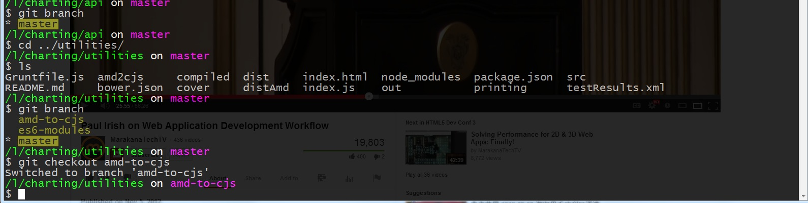

# Dotfiles

Bash profile and other user settings that make
my terminal (Console2) very user friendly.

Set [Console2](http://sourceforge.net/projects/console/files/) to use Windows Git bash:

    Edit / Settings / Tabs
    Set shell to "C:\Program Files (x86)\Git\bin\sh.exe --login -i"

The bash files should be in your user folder, usually linked
as your H drive.

The main difference from OSX: username is under variable *$USERNAME* and not *$USER*. Other settings pretty much intact from Paul Irish [dot files](https://github.com/paulirish/dotfiles)

## Questions?

Gleb Bahmutov <gleb.bahmutov@gmail.com>